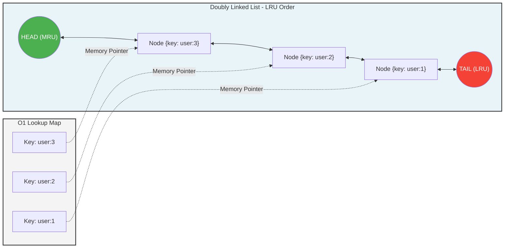

# Redis (Go Implementation)


A lightweight, high-performance, in-memory key-value store built entirely from scratch. This project implements a custom TCP server and the native REdis Serialization Protocol (RESP), designed to handle concurrent client connections safely and efficiently.

This is a deep-dive into backend systems architecture, focusing on low-level network programming, custom data structures, and thread-safe concurrency.

##  Key Features

* **Custom RESP Parser:** A robust, hand-written deserialization engine that processes raw byte streams into structured RESP types (Simple Strings, Bulk Strings, Arrays) with strict error handling for malformed requests.
* **Highly Concurrent:** Leverages Go's lightweight `goroutines` to handle multiple simultaneous client connections without blocking the main execution thread.
* **O(1) LRU Cache:** Implements a custom Doubly Linked List (DLL) integrated with a hash map to provide constant-time eviction and access for key-value pairs.
* **Thread-Safe State Management:** Utilizes a centralized data store protected by mutex locks to prevent race conditions during highly concurrent read/write operations.

##  Supported Commands

Currently, the engine supports the following operations, complete with inline LRU eviction logic:
* `SET` - Store a key-value pair.
* `GET` - Retrieve a value by key.
* `LPUSH` - Insert values at the head of a list.
* `RPUSH` - Insert values at the tail of a list.

##  Architecture & Design Decisions

Building a database from scratch requires balancing performance with data integrity. Here are the core architectural choices made in this implementation:

### 1. The Concurrency Model
To handle a massive influx of TCP connections, the server spins up a new goroutine for every active client. This allows the network I/O to remain entirely asynchronous. 

### 2. Thread-Safety via Mutex Locking
Because thousands of goroutines might attempt to read or mutate the cache simultaneously, the central in-memory store is currently protected by a single `sync.Mutex`. 
* *Trade-off:* While a single lock guarantees absolute data integrity and is easy to reason about, it can become a bottleneck under extreme write-heavy loads. Moving forward, I plan to explore **Lock Striping** (sharding the hash map) or `sync.RWMutex` to allow concurrent reads while maintaining safe writes.

### 3. Inline LRU Eviction
Instead of running a background garbage collection thread, the eviction logic is evaluated lazily/inline during standard command executions (`SET`, `GET`, etc.). The custom Doubly Linked List ensures that promoting a key to the "most recently used" position or dropping the "least recently used" tail takes `O(1)` time, keeping latency strictly bounded.

**Memory Engine Layout ($O(1)$ Lookups & Evictions):**


##  Getting Started

### Prerequisites
* Go 1.20+ installed locally.

### Build and Run
Clone the repository and start the TCP server:
```bash
git clone [https://github.com/BennyHinn04/redis-go.git](https://github.com/BennyHinn04/redis-go.git)
cd mini-redis
go run main.go